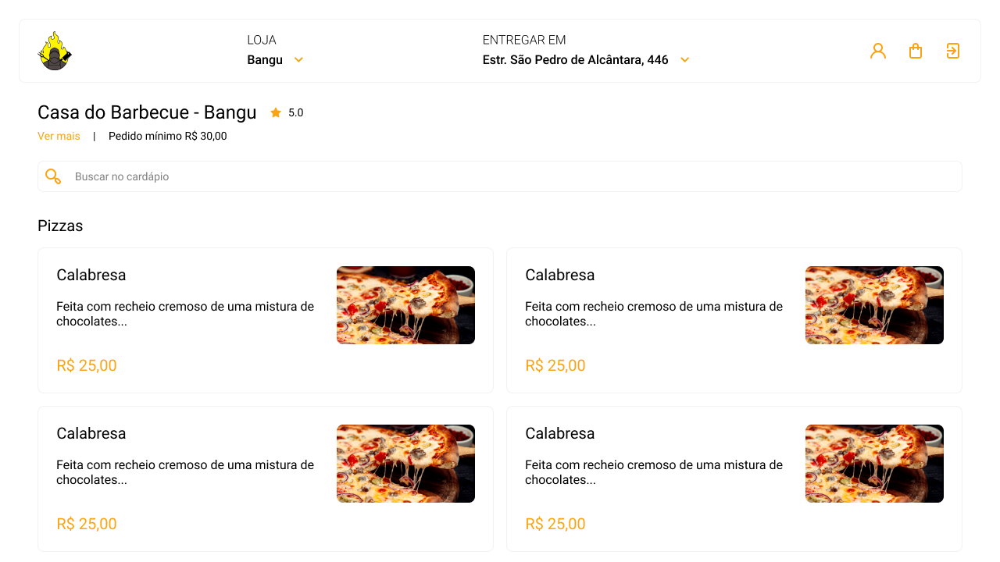

<h1 align="center">My-delivery</h1>

<p align="center">Esse projeto é um sistema delivery desenvolvido com TypeScript, Next.js, Node.js, GraphQL, TypeORM, PostgreSQL.</p>

---

<h1 align="center">
  
</h1>

<a href="https://my-delivery-pi.vercel.app/">Ver o projeto no ar</a>

### Features
- [x] ISR (incremental static regeneration)
- [x] Checkout transparente
- [x] Cardápio fornecido pela API em GraphQL
- [x] Banco de dados SQL com cardápio, pedidos e informações da loja
- [x] React Portals
- [ ] Totalmente responsivo

### Pré-requisitos

Antes de começar, você vai precisar ter instalado em sua máquina as seguintes ferramentas:
[Git](https://git-scm.com), [Node.js](https://nodejs.org/en/).

Além disto é bom ter um editor para trabalhar com o código como [VSCode](https://code.visualstudio.com/)

### Rodando a aplicação

```bash
# Clone este repositório
$ git clone https://github.com/andersonszdc/My-delivery
# Acesse a pasta do projeto no terminal/cmd
$ cd My-delivery/backend
# Faça uma cópia de '.env.example' para '.env.local'
# Coloque sua chaves secretas
$ copy .env.example .env.local
# repita o mesmo processo na pasta do frontend
# Instale as dependências
$ npm install
# Para iniciar o servidor, execute este comando
$ cd backend && npm run dev
# Para iniciar o front, execute este comando
$ cd frontend && npm run dev
```


### Tecnologias

As seguintes ferramentas foram usadas na construção do projeto:

- [TypeScript](https://www.typescriptlang.org/)
- [React](https://reactjs.org/)
- [Next.js](https://www.typescriptlang.org/)
- [Node.js](https://nodejs.dev/learn)
- [Express](https://expressjs.com/)
- [GraphQL](https://graphql.org/)
- [TypeORM](https://www.typescriptlang.org/)
- [PostgreSQL](https://www.postgresql.org/)
- [Apollo](https://www.apollographql.com/docs/)
- [Stripe](https://stripe.com/docs)
- [Styled Components](https://styled-components.com/)


---

### Autor


Made with 💜 by andersonszdc

<a href="https://www.linkedin.com/in/anderson-souza-b28431198/" target="_blank"></a>
<a href="https://www.instagram.com/andersonszdc" target="_blank"></a>